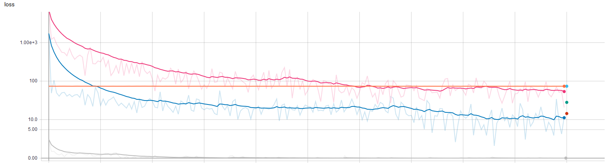
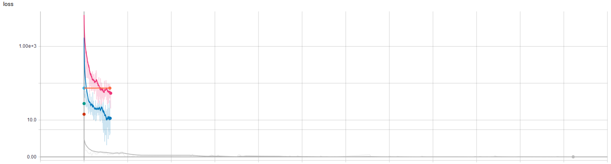
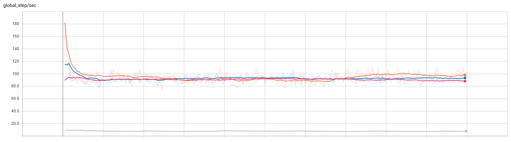

# Tensorflow Estimator Quickstart Code (MNIST)
This repository shows as clear as possible the Tensorflow Estimator API. This example focuses on clarity. It is absolutely not about being fast. But you should be able to use this repository for any other goal.

For other tuturials please check https://github.com/GoogleCloudPlatform/tf-estimator-tutorials. 

## Requirements and installation

Required packages:

- Tensorflow

To run this with the MINST dataset:
 - download the repository via `git clone https://github.com/takotab/estimator_quickstart_code`
 - change line 3 in [config.py](config.py) `data_loc = "E:\\data\\MNIST"  # CHANGE this` to a location on your computer where you want to store the data. 
 - run by using `python train.py`. 
 
There are other settings you can change in [train.py](train.py) or in [config.py](config.py).

## Models

There are 4 models:

- [Baseline](https://www.tensorflow.org/api_docs/python/tf/estimator/BaselineClassifier)
- [Simple Neural Network](https://www.tensorflow.org/api_docs/python/tf/estimator/DNNClassifier)
- [Deep & Wide](https://www.tensorflow.org/api_docs/python/tf/estimator/DNNLinearCombinedClassifier)
- [Custom](modelclass/model.py)

Three are premade Estimators by Tensorflow. And one is a custom model made by me. It easy to change the these Estimators for other (premade) Estimators.  To showcase some additional features I also added custom (random) features. The number of these extra wide features can be changed with `params.extra_wide_features` in [train.py](train.py). 

For instance:

swap: 
`wide.append(np.random.rand(params.extra_wide_features))` 

for:

` wide.append(np.random.rand(params.extra_wide_features) * int(line[0]) * 0.1)`

## Data

I used the [MNIST dataset](http://yann.lecun.com/exdb/mnist/) to showcase the different models. In this dataset the goal is classify a handwritten digit. To showcase some additional features I also added custom (random) features. You can edit their creation in [data.py](dataclass/data.py).

## Results

I have run the models and found some intresseting results. First the resulting accuracy:

| Model                         | Accurracy (test set) |
| ----------------------------- | -------------------- |
| Baseline                      | 11.25%               |
| Custom                        | 98.54%               |
| Deep & Wide                   | 77.50%               |
| Deep Neural Network [300 300] | 89.38%               |

The Custom model with Convolutional parts out preforms the others. However the the Deep & Wide does preform worse compared with the DNN. The DNN parts of both are the same and since the extra info the Deep & Wide gets is not relevant you would hypothocis they should preform equal. Espessaily when the weights accociated with the wide features are approximate 0 (as they should be).

Here you see the log of the cost during training against the the number of iteration:

You see the Custom model preforms much better. It is, however, good to also see the same graph against time:

The run time of the custum model is circa 15 times longer than the other models. This shows the relevancy of the premade simpler models. This runtime difference is also visible in the graph showing the number of global steps per second over the training:

## Usage Tips

Start with the data and get a result as soon as possible.  When doing a machine learning project the data more important than your model. Peter Warden wrote a nice [post](https://petewarden.com/2018/05/28/why-you-need-to-improve-your-training-data-and-how-to-do-it/) about this. In practice this means that you want to get a result early and then make your model more complicated one step at the time. This way you can see what works and have a quicker estimate what the bottleneck is.

This means:
- edit [data.py](data.py) to incoporate your dataset
- run all the model (`python train.py`)
- See results in Tensorboard (`tensorboard --logdir .\trainings_results`)
- Decide where to focus (data or model)

## Possible future improvements

- Possiblity for faster data input ([`tf.data.TextLineDataset`](https://www.tensorflow.org/api_docs/python/tf/data/TextLineDataset))
- Custom RNN
- Different dataset ([affNIST](http://www.cs.toronto.edu/~tijmen/affNIST/))
